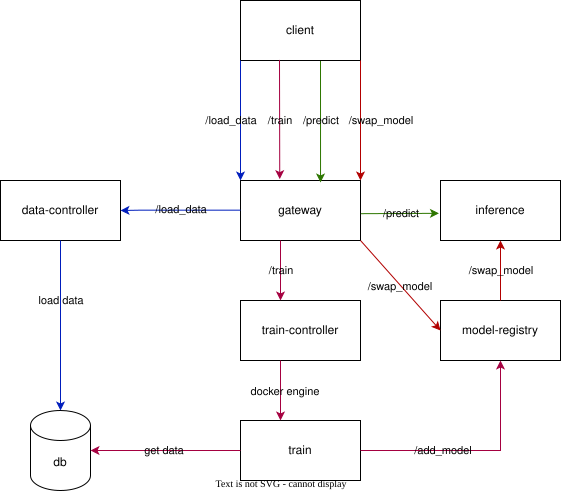

# ML Service

Микросервисный ML-проект для обучения, хранения, переключения и использования регрессионной модели на датасете Diamonds.

Проект построен как небольшой production-like ML backend: загрузка данных, обучение модели, регистрация артефактов, переключение активной версии и inference разделены между независимыми компонентами.

## Архитектура

Основные компоненты:

| Компонент | Порт | Назначение |
|---|---:|---|
| `gateway` | `8000` | Единая внешняя точка входа в систему |
| `inference` | `8001` | Хранит активную модель в памяти и выполняет prediction |
| `data-controller` | `8002` | Загружает CSV и сохраняет обучающие данные в PostgreSQL |
| `train-controller` | `8003` | Создаёт training job, хранит её статус и запускает `train` контейнер |
| `train` | one-shot job | Загружает данные, обучает и валидирует модель, затем завершает работу |
| `model-registry` | `8005` | Хранит версии моделей и управляет их активацией |
| `postgres` | `5432` | Хранилище обучающих данных |
| `ml_common` | — | Общая ML-библиотека для preprocessing и построения модели |


## Архитектура



## Основные сценарии

### Загрузка данных

```text
Client
→ Gateway
→ Data Controller
→ PostgreSQL
```

CSV отправляется через `Gateway`, после чего `data-controller`:

1. читает файл;
2. автоматически определяет разделитель CSV;
3. проверяет наличие обязательных колонок;
4. сохраняет данные в PostgreSQL.

Поддерживаются CSV с различными separator'ами, например `,` и `;`.

### Обучение модели

```text
Client
→ Gateway
→ Train Controller
→ Docker Engine
→ Train container
```

`POST /train` создаёт training job и возвращает `job_id`.

`train-controller` через Docker SDK автоматически запускает отдельный `train` контейнер и передаёт ему `JOB_ID`.

Контейнер `train`:

```text
PostgreSQL
→ DataFrame
→ train/validation split
→ ml_common
→ fit
→ validation
→ joblib
→ Model Registry
→ Train Controller status update
→ exit
```

Обучение выполняется асинхронно относительно API: Gateway и Train Controller не ждут окончания обучения.

После завершения контейнер `train` останавливается и автоматически удаляется.

### Регистрация модели

После успешной валидации `train` сериализует sklearn Pipeline в `joblib` и отправляет его в `model-registry`.

Registry генерирует уникальный `model_id` и сохраняет артефакт:

```text
/model-storage/
└── <model_id>/
    └── model.joblib
```

`model-storage` подключается как общий Docker volume к:

- `model-registry`;
- `inference`.

### Автоматическая активация первой модели

Если в Model Registry ещё нет моделей, первая успешно зарегистрированная модель автоматически активируется.

Это позволяет пройти сценарий:

```text
load-data
→ train
→ predict
```

без отдельного ручного swap после первого обучения.

Последующие модели регистрируются как отдельные версии и не заменяют активную автоматически.

### Активация модели

```text
Client
→ Gateway
→ Model Registry
→ Inference
```

Внешний запрос:

```text
POST /models/{model_id}/activate
```

Model Registry:

1. проверяет существование модели;
2. вызывает reload в `inference`;
3. `inference` загружает `model.joblib`;
4. только после успешной загрузки новая модель становится активной.

Если загрузка новой модели завершается ошибкой, текущая модель остаётся активной.

### Prediction

```text
Client
→ Gateway
→ Inference
→ active sklearn Pipeline
```

Inference хранит активную модель в памяти процесса.

Входные признаки:

```text
carat
depth
table
x
y
z
cut
color
clarity
```

Ответ содержит:

```json
{
  "prediction": 1234.56,
  "model_version": "<model_id>"
}
```

## ML Common

Общая ML-логика вынесена в локальный Python package:

```text
libs/
└── ml_common/
    └── src/
        └── ml_common/
            ├── constants.py
            ├── preprocessing/
            │   ├── cleaning.py
            │   ├── features.py
            │   └── transformer.py
            └── model/
                └── factory.py
```

`ml_common` используется и `train`, и `inference`.

Это важно в том числе для корректной десериализации `joblib`: custom preprocessing-функции имеют стабильные import path внутри общего пакета.

### Модель

Используется `HistGradientBoostingRegressor` внутри sklearn `Pipeline`.

Pipeline включает:

- очистку нулевых размерностей;
- генерацию геометрических признаков;
- удаление исходных `x`, `y`, `z`;
- one-hot encoding категориальных признаков;
- ordinal encoding `clarity`;
- регрессионную модель.

Train и Inference используют один и тот же Pipeline.

## Структура репозитория

```text
ml_service/
├── docker-compose.yml
├── docker/
│   └── postgres/
│       └── init.sql
│
├── libs/
│   └── ml_common/
│
├── services/
│   ├── gateway/
│   ├── data-controller/
│   ├── train-controller/
│   ├── train/
│   ├── model-registry/
│   └── inference/
│
└── model-storage/
```

`model-storage/` является runtime-хранилищем и не должен коммититься в Git.

## API

### Gateway — `:8000`

Основной внешний API проекта.

#### Health

```http
GET /health
```

#### Загрузка данных

```http
POST /load-data
```

Принимает CSV-файл.

#### Создание training job

```http
POST /train
```

Возвращает `job_id`.

#### Получение статуса обучения

```http
GET /train/{job_id}
```

Возможные статусы:

```text
created
running
completed
rejected
failed
```

#### Prediction

```http
POST /predict
```

#### Список моделей

```http
GET /models
```

#### Активация модели

```http
POST /models/{model_id}/activate
```

## PostgreSQL

PostgreSQL запускается как отдельный Docker container.

При первом старте автоматически выполняется:

```text
docker/postgres/init.sql
```

Init script:

- создаёт таблицу `training_data`;
- создаёт пользователя `data_controller_user`;
- создаёт пользователя `train_user`;
- выдаёт Data Controller права на запись;
- выдаёт Train права только на чтение.

Основная таблица:

```text
training_data
```

## Docker

Проект полностью запускается через Docker Compose.

Постоянно работающие контейнеры:

```text
postgres
gateway
data-controller
train-controller
model-registry
inference
```

`train` является one-shot контейнером и создаётся только на время обучения.

Все сервисы находятся в общей Docker network:

```text
ml-network
```

Благодаря этому сервисы обращаются друг к другу по DNS-именам Docker Compose:

```text
postgres
data-controller
train-controller
model-registry
inference
```

Например:

```text
http://inference:8001
http://model-registry:8005
```

## Запуск

### Требования

Для запуска достаточно:

- Docker;
- Docker Compose.

Для локальной Python-разработки дополнительно используется:

- Python 3.12;
- `uv`.

### Клонирование

```bash
git clone git@github.com:<username>/<repository>.git
cd <repository>
```

### Сборка

Для clean build:

```bash
docker compose build --no-cache
```

### Запуск

```bash
docker compose up
```

После запуска Swagger Gateway доступен по адресу:

```text
http://localhost:8000/docs
```

## Полный smoke test

После чистого запуска:

### 1. Загрузить CSV

Тестовые данные находятся в корне проекта: ```dataset.csv```

Через Gateway:

```text
POST /load-data
```

### 2. Запустить обучение

```text
POST /train
```

Получить:

```json
{
  "job_id": "...",
  "status": "created"
}
```

Train Controller автоматически создаст training container.

### 3. Проверять статус

```text
GET /train/{job_id}
```

После обучения ожидается:

```text
completed
```

### 4. Проверить модели

```text
GET /models
```

Новая модель должна появиться в списке.

Если это первая модель, она уже будет автоматически загружена в Inference.

### 5. Сделать prediction

```text
POST /predict
```

В ответе должны присутствовать prediction и model version.

## Сброс окружения

Чтобы остановить контейнеры:

```bash
docker compose down
```

Чтобы полностью удалить контейнеры вместе с PostgreSQL и model-storage volumes:

```bash
docker compose down -v
```

После этого следующий `docker compose up --build` создаст окружение с нуля и снова выполнит PostgreSQL init script.

## Локальная разработка

Каждый сервис является отдельным `uv` project и имеет собственное виртуальное окружение.

Пример:

```bash
cd services/gateway
uv sync
uv run uvicorn src.main:app --reload --port 8000
```

`ml_common` подключается как локальная dependency к сервисам, которым нужна общая ML-логика.

## Конфигурация

Локальная разработка может использовать `.env`.

В Docker runtime-настройки передаются через `docker-compose.yml`.

Примеры Docker URL:

```env
DATA_CONTROLLER_URL=http://data-controller:8002
TRAIN_CONTROLLER_URL=http://train-controller:8003
INFERENCE_URL=http://inference:8001
MODEL_REGISTRY_URL=http://model-registry:8005
DB_HOST=postgres
MODEL_STORAGE_PATH=/model-storage
```

Настоящие `.env` файлы не должны коммититься.

Для примеров конфигурации используются `.env.example`.

## Хранение состояния

### PostgreSQL

Хранит обучающий dataset.

### Model Storage

Хранит сериализованные модели в Docker volume.

### Train Controller

В текущем MVP статусы training jobs хранятся в памяти процесса.

После перезапуска `train-controller` история job теряется.

### Inference

Активная модель хранится в памяти процесса.

После рестарта Inference активная модель должна быть загружена заново.

## Текущие ограничения и возможные улучшения

Проект намеренно оставляет часть production-возможностей за рамками MVP.

Планируемые улучшения:

- хранение training jobs в PostgreSQL;
- хранение metadata моделей в БД;
- сохранение информации о текущей active model;
- автоматическое восстановление active model после рестарта Inference;
- хранение метрик модели (`RMSE`, `MAE`, `R²`) вместе с metadata;
- structured logging;
- централизованный error handling;
- unit и integration tests;
- healthchecks и readiness checks в Docker Compose;
- миграции БД;
- полноценное object storage вместо локального Docker volume;
- Kubernetes Jobs / Argo / Airflow вместо прямого доступа к Docker Engine;
- ограничение ресурсов training container;
- cleanup старых моделей;
- versioning dataset;
- authentication / authorization.


## Технологии

- Python
- FastAPI
- Pydantic
- pydantic-settings
- pandas
- NumPy
- scikit-learn
- joblib
- PostgreSQL
- SQLAlchemy
- psycopg
- httpx
- Docker
- Docker Compose
- Docker SDK for Python
- uv
